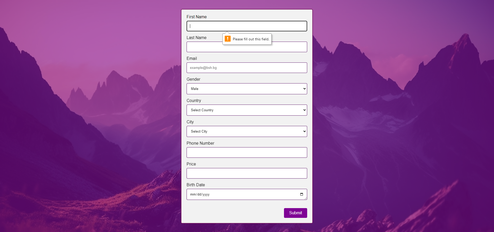

## Task:

Use HTML and CSS to create a **contact form** which should contain the following fields: **first name, last name, email, gender, country, city, phone, price, birth date.** Make sure to use the proper HTML tags and attributes to utilize that:
1.	First name, last name and email fields are mandatory.
2.	The email field should be automatically validated and would notify the user if the email is invalid.
3.	The phone number field should expect a user input in the following format: XXX-XXX-XXXX
4.	The gender field should allow the user to select between one of two values.
5.	The city and country fields should contain a list of items and should allow the user to select one value per field. Use the following JSON to populate the Countries and Cities. Based on a country selection, the appropriate cities should be shown.
6.	The birth date field should display a simple calendar control and shouldn’t allow the user to input invalid dates.
7.	The price field should only accept number values.
8. Then use CSS to add some simple styling to the form. 
Add a submit button to the form. Once the button is clicked, the user should receive a success message if the form is filled in properly (following the rules above). Otherwise, show an error message.

## Solution:

The biggest challenge from that task for me was fifth and eighth topic from the list.

I still haven't done eighth topic yet.

## Resources

<a href="https://stackoverflow.com/questions/36679649/how-to-add-a-color-overlay-to-a-background-image">CSS-background-image-overlay</a>
 
<a href="https://developer.mozilla.org/en-US/docs/Web/HTML/Element/input">MDN Input element documentation (First, Second, Third, Sixth, Seventh topics)</a>
 
<a href="https://developer.mozilla.org/en-US/docs/Learn/JavaScript/Client-side_web_APIs/Fetching_data">Fetching data from the server (Fifth topic)</a>
 
<a href="https://developer.mozilla.org/en-US/docs/Web/API/Document/DOMContentLoaded_event">DOMContentLoaded event (Fifth topic)</a>
 
<a href="https://www.tutorialspoint.com/how-to-allow-only-positive-numbers-in-the-input-number-type">Input type number (Seventh topic)</a>

